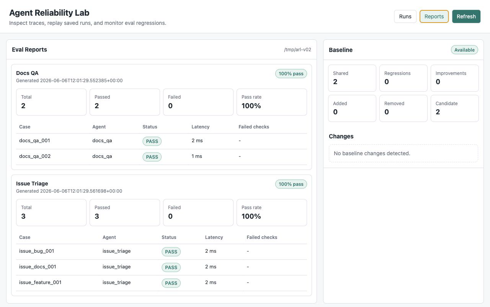

# Agent Reliability Lab

[](https://github.com/lpy235/agent-reliability-lab/actions/workflows/ci.yml)

Agent Reliability Lab is a lightweight evaluation and observability toolkit for LLM agents. It makes agent behavior recordable, inspectable, and regression-testable instead of treating each run as a black box.



## Why This Exists

LLM agents often change behavior when prompts, models, tools, or retrieval data change. This project turns those changes into engineering signals:

- What did the agent retrieve?
- What prompt did it build?
- Which citations support the answer?
- Did the eval case pass or fail?
- How long did the run take?
- Can the same case be tested again later?

## Features

- Trace SDK for agent runs and intermediate steps
- SQLite-backed run and step storage
- Local-document Docs QA agent for RAG evaluation
- Dry-run Issue Triage agent with simulated tool calls
- JSONL regression test suite
- Groundedness, citation, keyword, and latency checks
- PII redaction and dry-run tool policy checks
- Markdown eval reports for prompt and model changes
- JSON eval reports and baseline comparison JSON for regression tracking
- Saved-run replay with fixed retrieved context
- Run-to-run diff reports for answer, retrieval, steps, citations, and latency
- Compact browser dashboard for run, trace, eval report, and baseline inspection
- FastAPI endpoints for manual run inspection
- GitHub Actions CI for tests and the MVP harness

## Architecture

```text
sample_docs/ + question
        |
        v
DocsQAAgent / IssueTriageAgent
  - retrieve local chunks or analyze issue text
  - build grounded prompt or simulate dry-run tool calls
  - generate deterministic answer or triage decision
        |
        +--> Trace SDK --> SQLite runs.db
        |
        +--> JSONL eval runner --> Markdown + JSON reports
        |
        +--> Replay + Diff --> Markdown diff report
        |
        +--> Dashboard + FastAPI endpoints for run and report inspection
```

Core modules:

- `agents/`: retrieval, LLM clients, and Docs QA orchestration
- `agents/issue_triage_agent.py`: deterministic issue triage and dry-run tool calls
- `tracing/`: trace models, SDK, and SQLite persistence
- `safety/`: PII redaction and tool policy checks
- `evals/`: JSONL case loading, metrics, report generation, and CLI runner
- `app/`: FastAPI endpoints
- `app/web/`: framework-free dashboard
- `harness.py`: one-command MVP demo

## Quick Start

```bash
python -m venv .venv
source .venv/bin/activate
python -m pip install -e ".[dev]"
python -m pytest -v
arl-harness
```

The harness runs one sample Docs QA question, executes the JSONL eval suite, stores traces in `runs.db`, and writes Markdown plus JSON reports under `reports/`.

## Quick Demo

Run the harness:

```bash
arl-harness
```

Expected summary shape:

```json
{
  "sample_run": {
    "answer": "Set `DATABASE_URL` in the environment before starting the service.",
    "grounded": true,
    "run_id": "run_..."
  },
  "eval": {
    "total": 2,
    "passed": 2,
    "failed": 0,
    "pass_rate": 1.0
  },
  "issue_triage_eval": {
    "total": 3,
    "passed": 3,
    "failed": 0,
    "pass_rate": 1.0
  }
}
```

Static examples:

- [Sample Docs QA run](docs/examples/sample-run.json)
- [Sample issue triage run](docs/examples/issue-triage-run.json)
- [Sample eval report](docs/examples/eval-report.md)
- [Sample run diff](docs/examples/run-diff.md)
- [GitHub Actions CI template](docs/examples/github-actions-ci.yml)

## Continuous Verification

Use the same verification path locally and in the packaged CI template:

```bash
python -m pytest -v
arl-harness
```

The reusable workflow template is also kept at [docs/examples/github-actions-ci.yml](docs/examples/github-actions-ci.yml).
CI uploads the generated Markdown reports, JSON reports, and `runs.db` as the `agent-reliability-lab-reports` artifact for each run.

## Run JSONL Evals

```bash
arl-eval evals/cases/docs_qa.jsonl \
  --docs-dir sample_docs \
  --db-path runs.db \
  --report-path reports/eval-report.md \
  --json-report-path reports/eval-report.json
```

The eval command exits with a nonzero status when any case fails, so it can be used in CI.

Run the issue triage eval suite:

```bash
arl-eval evals/cases/issue_triage.jsonl \
  --db-path runs.db \
  --report-path reports/issue-triage-report.md \
  --json-report-path reports/issue-triage-report.json
```

Issue triage evals can assert required tool calls, forbidden tool calls, PII redaction, approval-required tools, and maximum safety violations.

## Compare Eval Baselines

Compare two JSON eval reports:

```bash
arl-baseline reports/baseline-eval-report.json reports/eval-report.json \
  --report-path reports/baseline-comparison.md \
  --json-report-path reports/baseline-comparison.json
```

The command exits with a nonzero status when a previously passing shared case regresses.
CI gates the Docs QA suite against [baselines/docs_qa_eval_report.json](baselines/docs_qa_eval_report.json) and uploads Markdown plus JSON baseline comparison reports with the other reliability artifacts.

## Replay And Diff Runs

Replay a saved run with its original retrieved chunks:

```bash
arl-replay <run_id> --db-path runs.db
```

Compare two saved runs and write a Markdown report:

```bash
arl-diff <base_run_id> <candidate_run_id> \
  --db-path runs.db \
  --report-path reports/run-diff.md
```

Replay is useful when you want to rerun the same input while controlling retrieval context. Diff is useful when a prompt, model, or docs change and you need to see which behavior actually moved.

## Run Docs QA Through The API

```bash
arl-api --reload
```

Open the dashboard:

```text
http://127.0.0.1:8000/dashboard
```

The dashboard has a Runs view for trace/replay/diff inspection and a Reports view for Docs QA, Issue Triage, and baseline comparison summaries. Set `AGENT_RELIABILITY_REPORTS_DIR` to point the API at a different reports directory.

In another shell:

```bash
curl -X POST http://127.0.0.1:8000/agents/docs-qa/run \
  -H "Content-Type: application/json" \
  -d '{"question":"How do I configure the database?","docs_dir":"sample_docs"}'
curl -X POST http://127.0.0.1:8000/agents/issue-triage/run \
  -H "Content-Type: application/json" \
  -d '{"title":"App crashes when uploading large files","body":"The upload page freezes after selecting a 2GB file."}'
```

Inspect saved runs:

```bash
curl http://127.0.0.1:8000/runs
curl http://127.0.0.1:8000/runs/<run_id>
curl -X POST http://127.0.0.1:8000/runs/<run_id>/replay \
  -H "Content-Type: application/json" \
  -d '{"fixed_context":true}'
curl "http://127.0.0.1:8000/runs/diff?base_run_id=<run_id>&candidate_run_id=<run_id>"
```

## What This Demonstrates

This project is not a chat demo. It demonstrates reliability engineering for tool-using and retrieval-augmented LLM agents:

- evaluation harness design
- trace and observability primitives
- regression testing for prompt and retrieval behavior
- replay and diff workflows for saved agent behavior
- dry-run tool-call reliability checks for issue triage
- lightweight safety checks for PII and tool policy violations
- inspectable RAG groundedness checks
- API and CLI surfaces over the same core agent logic

## CLI Commands

- `arl-harness`: run the local demo, Docs QA evals, and issue triage evals.
- `arl-eval`: run a JSONL eval file and write a Markdown report.
- `arl-baseline`: compare two JSON eval reports and flag regressions.
- `arl-replay`: replay a saved Docs QA run with fixed or live retrieval context.
- `arl-diff`: compare two saved runs and optionally write a Markdown diff report.
- `arl-api`: start the FastAPI app and browser dashboard.

## Project Documents

- [Project overview](Agent_Reliability_Lab_项目说明.md)
- [Changelog](CHANGELOG.md)
- [v0.2.0 release notes](docs/releases/v0.2.0.md)
- [v0.1.0 release notes](docs/releases/v0.1.0.md)
- [MVP design spec](docs/superpowers/specs/2026-06-04-agent-reliability-lab-mvp-design.md)
- [MVP implementation plan](docs/superpowers/plans/2026-06-04-agent-reliability-lab-mvp.md)
- [GitHub presentation and CI plan](docs/superpowers/plans/2026-06-04-github-presentation-ci.md)
- [Replay and diff design](docs/superpowers/specs/2026-06-04-replay-diff-design.md)
- [Issue Triage Agent design](docs/superpowers/specs/2026-06-04-issue-triage-agent-design.md)
- [Safety and tool policy design](docs/superpowers/specs/2026-06-04-safety-tool-policy-design.md)
- [Dashboard design](docs/superpowers/specs/2026-06-04-dashboard-design.md)
- [CLI packaging design](docs/superpowers/specs/2026-06-04-cli-packaging-design.md)

## Tech Stack

- Python
- FastAPI
- SQLite
- pytest
- GitHub Actions
- OpenAI-compatible LLM API support

## Scope

The MVP focuses on agent reliability engineering: tracing, RAG evaluation, regression testing, and inspectable reports. It intentionally avoids private user-memory systems, proactive companion behavior, or unrelated personal-agent product concepts.

## License

MIT License.
